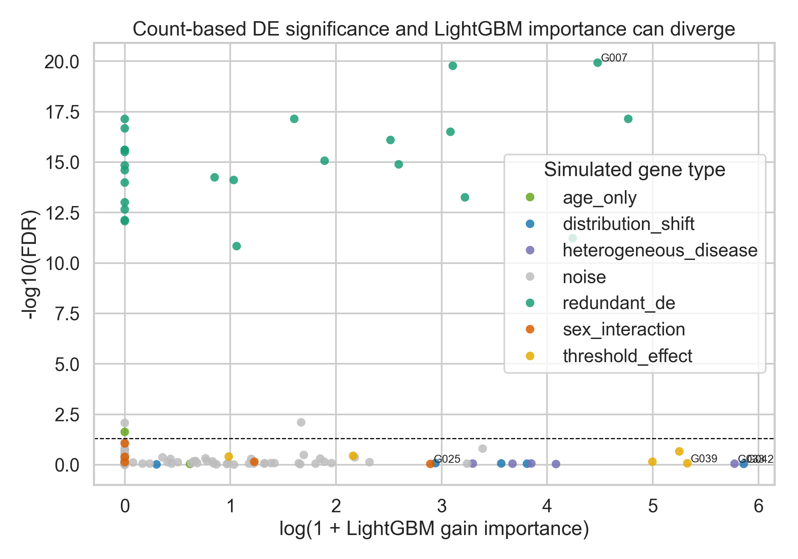
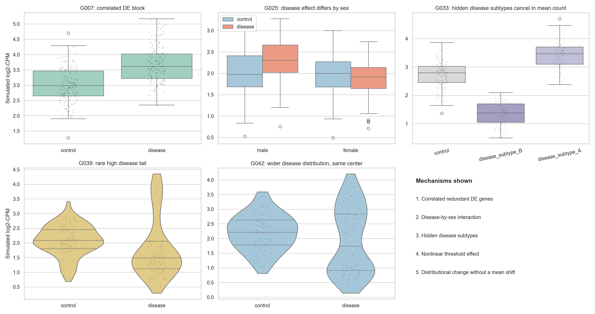
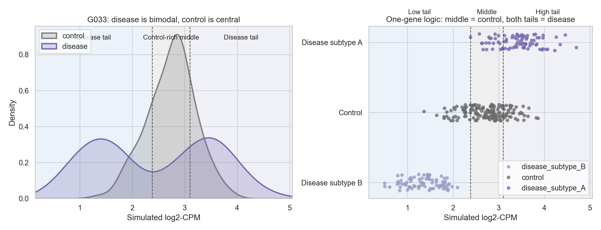

# DE vs ML Feature Importance Simulation

This directory contains a count-based RNA-seq simulation designed to answer a very specific question:

Why do some genes look important in differential expression (DE) but not in a machine learning classifier, while other genes look important in the classifier but not in DE?

The short answer is that the two analyses are asking different statistical questions.

- Differential expression asks: does this gene show a disease-related mean shift after adjustment for covariates?
- LightGBM asks: does this feature help classify disease versus control inside a joint, nonlinear, redundancy-aware model?

Because those are different targets, disagreement is not only possible, it is often expected.

This README is written so that you can understand the simulation conceptually without reading the code.

## What This Simulation Does

The script simulates bulk RNA-seq-like count data from a negative-binomial model with:

- sample-specific library size variation
- per-gene baseline expression differences
- per-gene dispersion differences
- covariates such as age and sex
- multiple biologically plausible mechanisms that can separate DE from ML feature importance

After generating counts, it runs two analyses:

1. A `PyDESeq2` differential expression workflow.
   The main DE model uses an additive design:
   `~ age + sex_label + disease_label`

2. A LightGBM binary classifier.
   The classifier uses all genes simultaneously, after converting counts to `log2-CPM`, together with `age` and `sex`.

For interpretability, the simulation also fits a second `PyDESeq2` model with a disease-by-sex interaction term:
`~ age + sex_label + disease_label + sex_label:disease_label`

That second fit is not the main DE analysis. It is there to help explain why some interaction-driven genes can matter for classification even when the additive DE model gives a weak disease main effect.

## Run

```bash
python3 simulate_de_vs_ml.py --output-dir simulation_output
```

The figures embedded below were generated from a recent run saved in `simulation_output_pydeseq2/`. If you rerun the script into another directory, you will get analogous files there.

## Core Idea

The simulation is built around two asymmetries:

- A gene can be statistically significant in DE but add little predictive value once many correlated genes are already in the model.
- A gene can be useful for classification even when it has little or no disease mean shift, because trees can use thresholds, multiple splits, subgroup structure, and tail behavior.

That is the entire logic of the project.

## What the Simulation Injects

### 1. `redundant_de`

These genes all have a genuine disease-related mean shift, so they tend to be significant in DE.

However, many of them are correlated with one another and carry overlapping information. A tree ensemble does not need to repeatedly use every redundant gene. Once it finds a few good representatives, the rest may have low or zero marginal gain importance.

Conceptually:

- DE result: often strong
- ML importance: can be low because the information is duplicated elsewhere

This is the main mechanism for:

**DE-significant, but low feature importance**

### 2. `sex_interaction`

These genes behave differently in disease depending on sex. For example, disease may increase the gene in one sex and decrease it or barely change it in the other.

If you fit only an additive disease effect, those opposite directions can partially cancel. That makes the disease main-effect estimate weak, even though the gene is still informative when the model can carve up the sample space in a more flexible way.

Conceptually:

- DE result from an additive model: can be weak
- Interaction-specific DE model: stronger
- ML importance: may be meaningful because the tree can combine the gene with sex-related splits

This is one mechanism for:

**High ML importance, but weak additive DE**

### 3. `heterogeneous_disease`

These genes differ across hidden disease subtypes. In the simulation, the disease group is secretly split into two subgroups:

- one subtype has higher expression than control
- the other subtype has lower expression than control

Those opposite shifts are balanced so that the overall disease mean is similar to control. An additive DE model focused on the average disease effect can therefore miss them.

But LightGBM can still use them, because extremely low values and extremely high values can both be disease-enriched. This is the “middle = control, both tails = disease” idea.

Conceptually:

- DE result: weak because the mean cancels
- ML importance: high because the distribution is informative

This is another mechanism for:

**High ML importance, but weak DE**

### 4. `threshold_effect`

These genes are designed to create a nonlinear rule.

In disease samples, most values are mildly lower than control, but a smaller subset of disease samples falls into a very high-expression tail. The proportions are chosen so that the average disease expression stays close to control.

That means there may be little overall mean shift, but there is still a useful classification rule:

- if the gene is very high, that strongly suggests disease

A tree model can discover that threshold. A standard DE test, which is mainly targeting a mean difference, may not find much signal.

Conceptually:

- DE result: can be weak because the high tail is balanced by more common low values
- ML importance: can be high because the rare high tail is highly informative

This is a direct example of:

**Nonlinear threshold effects without a strong average shift**

### 5. `distribution_shift`

These genes have a distributional change without a mean shift.

Control samples are relatively concentrated near the center. Disease samples are more dispersed into the tails. The mean stays approximately the same, but the shape of the distribution changes.

So the classifier can learn a rule like:

- values near the center look more control-like
- unusually extreme values look more disease-like

Again, this is useful to a tree, but not necessarily to a DE method centered on the disease mean effect.

Conceptually:

- DE result: weak because the center stays the same
- ML importance: can be high because tail behavior is informative

This is the clearest example of:

**Distributional change without a mean shift**

### 6. `age_only`

These genes depend on age but not disease. They make the simulation more realistic and test whether the analyses properly adjust for covariates.

They are not meant to be a DE-vs-ML mismatch mechanism. They are a control category.

### 7. `noise`

These genes are null by design.

They are included so the simulation has a large background of irrelevant genes, as real transcriptomic data do. Some may still get nonzero importance or even occasional nominal significance by chance, just as in real high-dimensional analyses.

## What Gets Written

- `simulation_output/summary.txt`: short textual summary of the run
- `simulation_output/gene_level_results.csv`: per-gene category, simulation parameters, `PyDESeq2` results, and LightGBM gain
- `simulation_output/category_summary.csv`: counts by simulated mechanism
- `simulation_output/all_predictor_importance.csv`: LightGBM gain for genes plus covariates
- `simulation_output/sample_metadata.csv`: synthetic phenotype table, covariates, hidden subtype labels, and library sizes
- `simulation_output/counts_matrix.csv`: simulated raw counts
- `simulation_output/log_cpm_matrix.csv`: transformed matrix used by LightGBM
- `simulation_output/de_vs_gain_scatter.png`: global view of DE significance versus ML importance
- `simulation_output/mechanism_examples.png`: multi-panel figure showing the main mismatch mechanisms
- `simulation_output/two_tails_logic.png`: focused figure for the subtype-driven “middle = control, both tails = disease” mechanism

## How To Read the Results

The main comparison is between:

- `fdr` from `PyDESeq2`
- `lightgbm_gain` from the classifier

Interpret them as follows:

- Low `fdr`, low gain:
  the gene has a real average disease shift, but may be redundant once other genes are included

- Low `fdr`, high gain:
  the gene has a mean shift and is also useful for prediction

- High `fdr`, high gain:
  the gene is predictive for reasons other than a simple additive mean shift

- High `fdr`, low gain:
  the gene is mostly uninformative

## Sample Figures

### 1. Overall DE vs ML disagreement

This scatter plot is the top-level summary. Genes high on the y-axis are DE-significant. Genes far to the right have high LightGBM gain. The interesting cases are the off-diagonal ones.



### 2. Mechanism gallery

This panel figure shows one representative gene from each major mechanism:

- top left: correlated redundant DE block
- top middle: disease-by-sex interaction
- top right: hidden disease subtype mechanism
- bottom left: nonlinear threshold effect
- bottom middle: distributional shift without a mean shift

The bottom-right panel is a text legend summarizing what the other panels represent.



### 3. “Middle = control, both tails = disease”

This figure zooms in on the subtype-driven heterogeneous disease mechanism. It is the most intuitive example of why a gene can be useful to LightGBM but weak in additive DE.

The left panel shows that disease is bimodal while control sits in the middle.  
The right panel shows the same logic by subtype, making the “both tails imply disease” idea explicit.



## Interpretation

The most important conceptual point is that DE and tree-based feature importance are not competing estimates of the same quantity.

They are answering different questions.

### What DE is asking

In the additive `PyDESeq2` model, each gene is analyzed one at a time. The question is roughly:

> after adjusting for age and sex, does this gene show a disease-related mean change in counts?

That is a univariate, gene-specific question about an average effect.

This is why DE is naturally sensitive to:

- main effects on the mean
- direction and magnitude of average change
- sample size and dispersion

This is also why DE can miss:

- opposing subgroup effects that cancel
- threshold-driven disease patterns
- distributional changes where the mean stays fixed
- interactions that are not represented in the fitted formula

### What LightGBM is asking

LightGBM does not summarize each gene with one additive coefficient.

Instead, it asks:

> does this feature help split the samples into more outcome-pure groups when used together with all the other features?

That is a multivariate predictive question, not a gene-wise mean-shift question.

This makes LightGBM naturally sensitive to:

- nonlinear thresholds
- repeated splits on the same feature
- interactions with other genes or covariates
- subgroup structure
- tail behavior
- redundancy-aware selection among correlated genes

A single gene can therefore matter to LightGBM even if it has no clean average disease effect.

### Why repeated splits matter

One especially important point for intuition:

Trees can split on the same feature more than once.

That means a single gene can support rules like:

- very low expression suggests disease
- middle expression suggests control
- very high expression suggests disease

This is impossible to represent with one additive disease coefficient in a standard DE model, but it is very natural for a tree ensemble.

### Why significance and feature importance diverge

A p-value and a feature-importance score are not on the same conceptual scale.

- A p-value measures evidence against a null hypothesis for one gene at a time.
- Feature importance measures how much a predictor helped the fitted classifier.

Those differ because:

- significance is not the same as predictive utility
- predictive utility depends on what other predictors are already in the model
- feature importance can be shared or “stolen” among correlated predictors
- tree models can use nonlinear and multistep decision rules

So “DE-significant but low importance” and “important but not DE-significant” are both reasonable outcomes.

### What the simulation is trying to teach

The simulation is not making the claim that every real RNA-seq mismatch comes from exactly these five mechanisms.

Instead, it shows several concrete ways the mismatch can arise:

1. true mean-shift signal that is redundant across many genes
2. interaction structure that an additive DE model does not target
3. hidden disease subtypes with canceling average effects
4. threshold rules that matter more than averages
5. distributional changes that affect tails more than centers

If you see disagreement between DE and ML feature importance in real data, that should not automatically be treated as a contradiction. It may instead be a clue about the structure of the signal.

## Practical Take-Home Message

If a gene is DE-significant but not important to LightGBM, it may be:

- genuinely shifted on average, but redundant with other genes
- statistically detectable, but not especially useful once all predictors are modeled jointly

If a gene is important to LightGBM but not DE-significant, it may be:

- interaction-driven
- subgroup-specific
- threshold-driven
- distribution-driven rather than mean-driven

That is exactly what this simulation is built to demonstrate.
